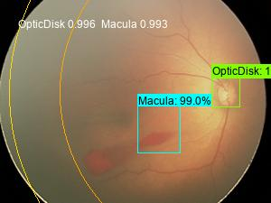

# About

We provide a set of object detection neural network training and evaluation functions.  
We currently support Faster-RCNN, SSD and YOLO(todo). An infant funuds image object detection application is provided.  

# Credit

The following 3rd-party packages are used: 
1. The Faster-RCNN module is based on https://github.com/kentaroy47/frcnn-from-scratch-with-keras. We have updated the code according to the latest keras API change (K..image_dim_ordering () -> K.image_data_format()).   
2. Data augmentation package (https://github.com/Paperspace/DataAugmentationForObjectDetection).   
3. SSD (Single Shot MultiBox Detector) by tensorflow. We took lots of efforts to integrate tensorflow's objection detection and slim source, mainly revising the relative importing. https://github.com/tensorflow/models/research/object_detection and https://github.com/tensorflow/models/research/slim    
4. The darkflow framework (https://github.com/thtrieu/darkflow)


# Install

    pip install tensorflow-gpu == 1.14.0  
    pip install tf-slim 
    pip install odn

For tf_ssd, we need to add odn\tf_ssd\protoc-3.4.0-win32\bin to PATH, then run:
    cd tf_ssd  
    protoc object_detection/protos/*.proto --python_out=.

# How to use - FRCNN

1. Output images with annotations

    from odn.fundus import dataset

    dataset.synthesize_anno(label_file = '../data/fundus/all_labels.csv', 
    dir_images = '../data/fundus/images/', 
    dir_output = '../data/fundus/ground_truth/',    
    verbose = True,
    display = 5 )

    The labe file should be in this format:

        seq,class,cx,cy,filename,height,laterality,width,xmax,xmin,ymax,ymin
        259,Macula,384,293,00569c080bf51c7f182cbe4c76f1823a.jpg,480,L002,720,436,332,345,241
        668,OpticDisk,191,275,00569c080bf51c7f182cbe4c76f1823a.jpg,480,L002,720,224,158,308,242


    The generated image is like this:   
    

2. Split dataset

    dataset.split(label_file = '../data/fundus/all_labels.csv', 
        dir_images = '../data/fundus/images/', 
        train_output = '../data/fundus/train.txt', 
        test_output = '../data/fundus/test.txt',
        test_size = 0.2, verbose = True)

3. Train a new model by transfer learning uing pre-trained PRN weigths

    cmd and cd to the the odn folder:

    > python -m odn.train_frcnn -o simple -p ../../data/fundus/train.txt --network vgg16 --rpn ./models/rpn/pretrained_rpn_vgg_model.36-1.42.hdf5 --hf true --num_epochs 20 

    or if using github source,

    > python train_frcnn.py -o simple -p ../../data/fundus/train.txt --network vgg16 --rpn ./models/rpn/pretrained_rpn_vgg_model.36-1.42.hdf5 --hf true --num_epochs 20 

    from odn import utils

    utils.plot_training_curves(input_file = '../src/odn/training_log.txt', output_file = '../src/odn/training_curves.png')

    

4. Test
   
   > python -m odn.test_frcnn --network vgg16 -p ../../data/fundus/test_public.txt --load models/vgg16/19e.hdf5 --num_rois 32 --write 

   or if using github source,

   > python test_frcnn.py --network vgg16 -p ../../data/fundus/test_public.txt --load models/vgg16/19e.hdf5 --num_rois 32 --write 

    A candidate_rois.txt with all candidate ROIs will be generated.

5. ROI filtering

    from odn.fundus import annotation, dataset

    annotation.rule_filter_rois(input_file = '../src/odn/candidate_rois.txt', 
        output_file = '../src/odn/rois.txt',
        verbose = True)

    dataset.synthesize_anno('../src/odn/rois.txt', 
    dir_images = '../data/fundus/images_public/', 
    dir_output = '../data/fundus/odn_19e/',
    drawzones = True, # set true if you want to draw ROP zones    
    verbose = True,
    display = 5 )

    or output annotated images in place:

    dataset.synthesize_anno('../src/odn/rois.txt', 
                            dir_images = '../data/fundus/images_public/', 
                            dir_output = 'inplace',
                            drawzones = True,
                            verbose = True,
                            suffix = '_FRCNN', # inplace image name suffix
                            display = 5 )

6. Evaluation
   
   6.1 Output a single comparison plot

    from odn import metrics 

    metrics.fundus_compare_metrics(gt = '../data/fundus/all_labels.csv', 
    pred = '../src/odn/rois.txt', 
    output_file = './comparison_with_metrics.jpg',
    image_dirs = [
        '../data/fundus/ground_truth_public', 
        '../data/fundus/odn_19e_raw',   
        '../data/fundus/odn_19e_naive',
        '../data/fundus/odn_19e'], verbose = True )

    
    
    6.2 Output image-wise comparison plot

    fundus_compare_metrics_separate(input_file = '../src/odn/rois.txt', 
    output_dir = './comparison_separate/',
    image_dirs = [
        '../data/fundus/ground_truth_public', 
        '../data/fundus/odn_19e_raw', 
        '../data/fundus/odn_19e'], verbose = True )

    6.3 Only output comparison results that are differents between different detection algorithms

    fundus_compare_metrics_html(gt = '../data/fundus/all_labels.csv', pred = '../src/odn/rois_naive.txt')

    fundus_compare_metrics(gt = '../data/fundus/all_labels.csv', 
    pred = '../src/odn/rois.txt', 
    output_file = './comparison_with_metrics_diff.jpg',
    image_dirs = [
        '../data/fundus/ground_truth_public', 
        '../data/fundus/odn_19e_raw',   
        '../data/fundus/odn_19e_naive',
        '../data/fundus/odn_19e'], image_subset = image_subset, verbose = True )

    

# How to use - TF-SSD

1. Follow our notebook (8.4 Object Detection - Fundus - TF-SSD ) to build the tfrecord.

2. Training

    cmd > cd to '/odn/tf_ssd' > run:

    python train.py --logtostderr --train_dir=training --pipeline_config_path=ssd_mobilenet_v1_fundus.config

    To use a pretrained model, revise ssd_mobilenet_v1_fundus.config:

        fine_tune_checkpoint: "../tf/export/model.ckpt"

    If the training runs correctly, should output something like:

```
    INFO:tensorflow:global step 1906: loss = 4.3498 (3.848 sec/step)
    I0610 11:49:51.364413 13848 learning.py:512] global step 1906: loss = 4.3498 (3.848 sec/step)
    INFO:tensorflow:global step 1907: loss = 3.9057 (3.903 sec/step)
    I0610 11:49:55.267028 13848 learning.py:512] global step 1907: loss = 3.9057 (3.903 sec/step)
    INFO:tensorflow:global step 1908: loss = 3.4026 (3.856 sec/step)
```

3. Export model as tf graph

    python export_inference_graph.py --input_type image_tensor --pipeline_config_path ssd_mobilenet_v1_fundus.config --trained_checkpoint_prefix training/model.ckpt-1945 --output_directory ./export2002206

4. Prediction

```
    from odn.fundus import annotation 

    # get image file list to predict
    FILES = utils.get_all_images_in_dir(folder = '../data/fundus/images_public/') 

    # load tf graph model
    detection_graph, category_index = annotation.load_tf_graph(ckpt_path = '../src/odn/tf_ssd/export/frozen_inference_graph.pb',
                    label_path = '../src/odn/tf_ssd/fundus_label_map.pbtxt', 
                    num_classes = 2)

    # object detection
    annotation.tf_batch_object_detection(detection_graph, category_index, FILES, 
                                    '../data/fundus/ssd/', 
                                    '../data/fundus/ssd_202206.txt', 
                                    new_img_width = 300, fontsize = 12)


    Or output annotated images in place:

    annotation.tf_batch_object_detection(detection_graph, category_index, FILES, 
                                  'inplace', 
                                  '../data/fundus/ssd_202206.txt',                        
                                  new_img_width = 900, fontsize = None, suffix = '_SSD')
```

The annotated images will be generated in the ssd folder. A sample image is as follows,   
    
We draw ROP Zone I, Posterior Zone II and Zone II.

# How to use - Camera App

    from odn import camera

    camera.realtime_object_detection(ckpt_path = '../src/odn/models/ssd_mobilenet_v2_coco_2018_03_29/frozen_inference_graph.pb',
                    label_path = '../src/odn/models/mscoco_label_map.pbtxt', 
                    num_classes = 90)

# Jupyter notebooks

Under /notebooks, we provide several examples for both general-purposed and fundus image object detection.   

# Dataset

data/fundus/images_public : a fundus image set in courtesy of SZEH (Shenzhen Eye Hospital)   
data/fundus/ground_truth_public : images with ground truth annotations   
data/fundus/frcnn_19e_zones : object detection results by FRCNN (trained 19 epochs)   
data/fundus/ssd : object detection results by SSD (Single Shot MultiBox Detector)  

# Deployment

After training, you will get a keras h5 model file. You can further convert it to tflite format, or tfjs format.    
Then you can deploy on mobile device or browser-based apps.